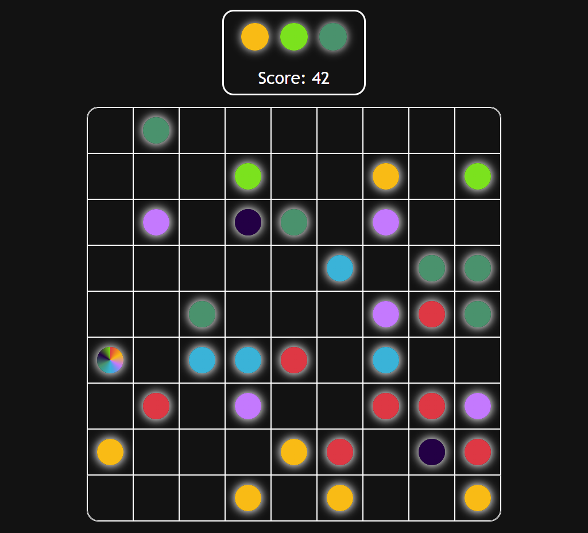

# Balls-Game
A game written in typescript about moving balls

##  Introduction

The goal of the game is to move the balls to destroy them.

Rules:
- To destroy balls, place a minimum of 3 balls of the same color next to each other (horizontally, vertically, diagonally)
- Each move without destroying the balls spawns 3 new balls
- The game ends when there is no more space on the board

## Installation

 - Clone/download the repository
 - In the terminal run `npm i` to install dependencies  
 - In the terminal run `npm run build` to build project
 - Run `\dist\index.html` to play the game  
    

## Features

- Pathfinding algoritm
- Score system
- 'Joker' (ball works with any colour)
- Possibility to create documentation `npm run doc`
